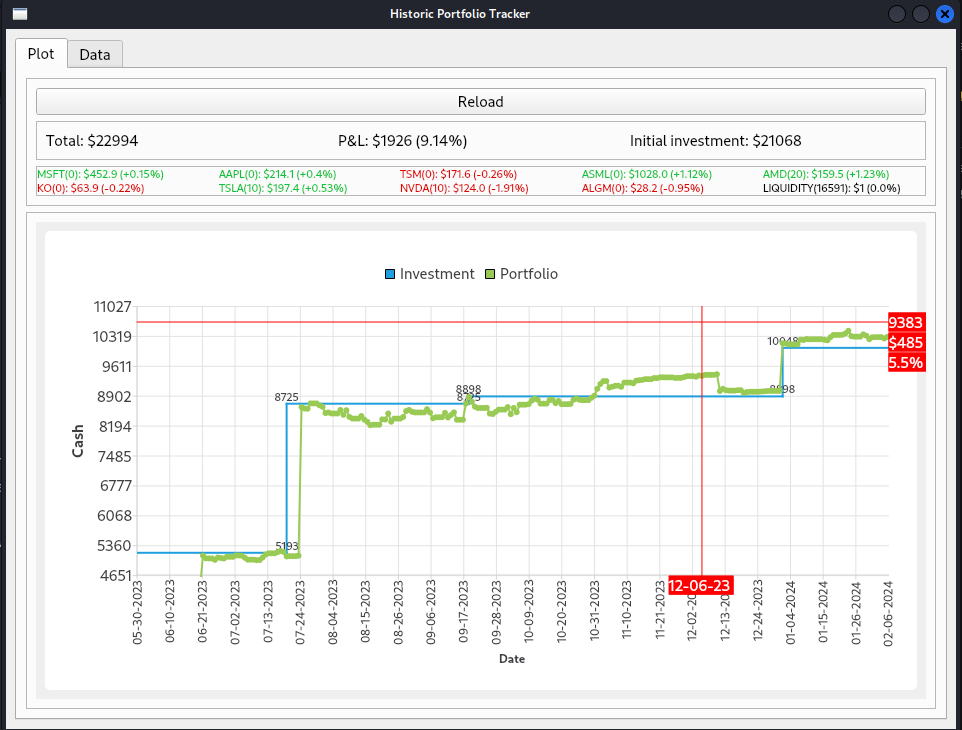
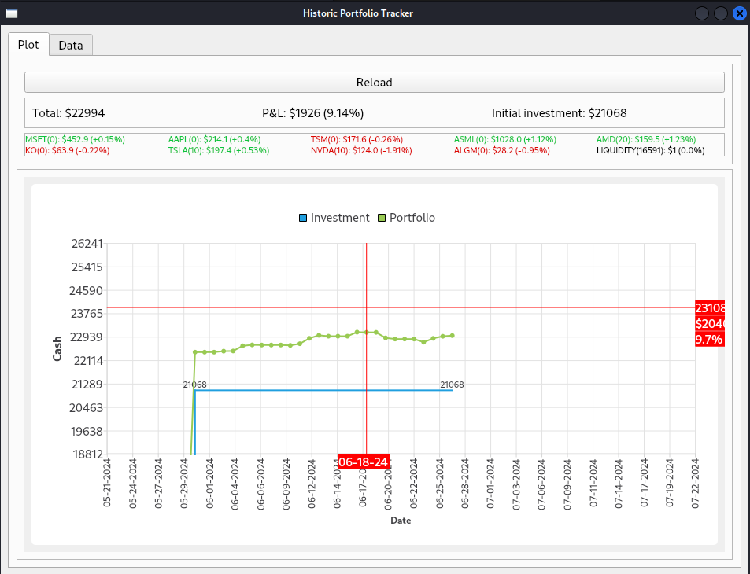
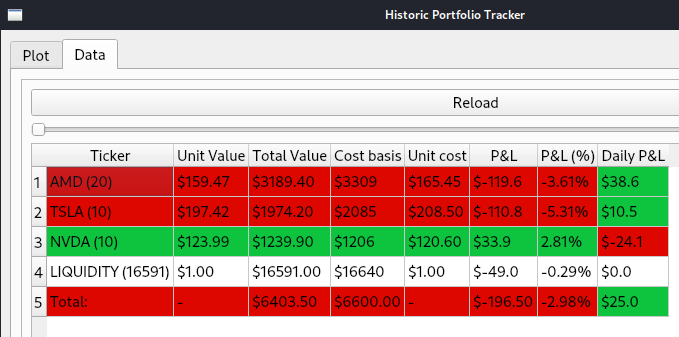

# Historic Stocks Portfolio Tracker (hportfolio)

This is a tool intended for tracking historic evolution of the portfolio of an individual. The main purpose of the tool is to see the total amount of cash at a given point in time.



## Features:

- Stock prices automatically synced with Yahoo Finance data.
- Provide a quick overview of daily activity of several tickers at once.
- Compare portfolio performance VS investment.
- Effortlessly view profits and losses.
- Easy to track cost basis, unit cost, P&L ($), P&L (%) for each stock in your portfolio.

## Future improvements:

- Automatically sync stocks with most known brokers.
- Learn about success trades performed by the user to suggest future buy/sell actions.
- Real-Time market data and alerts.


## Usage


Requires `Python >= 3.11`. A newer version is also acceptable.

Clone the repository into a local workspace:

```shell
git clone <project_path>
cd hportfolio
```

Create and activate a virtual environment ([venv](https://docs.python.org/3/library/venv.html)) for `hportfolio` development. Replace the python binary path to the desired version.
```shell
/apps/python/3.11.2/bin/python3 -m venv .venv --clear
source .venv/bin/activate.csh
```

### User environment

Install `hportfolio` package using pip

```shell
python -m pip install ."
```

Is this is the first time installing the package, deactivate and activate the virtual environment to refresh the alias:

```shell
deactivate
source .venv/bin/activate.csh
```

Finally, launch it

```shell
hportfolio
```


### Development environment

Install `hportfolio` package in editable mode with all development dependencies

```shell
python -m pip install --upgrade --editable ".[dev]"
```

Finally, deactivate and activate the virtual environment to have the correct command alias when running __hportfolio__

```shell
deactivate
source .venv/bin/activate.csh
```

## Screenshots

<div style="text-align: center;">
  
  <p><em>Zooming in to see more details in specific dates</em></p>
</div>

<br>

<div style="text-align: center;">
  
  <p><em>Details for active stocks in the portfolio</em></p>
</div>
